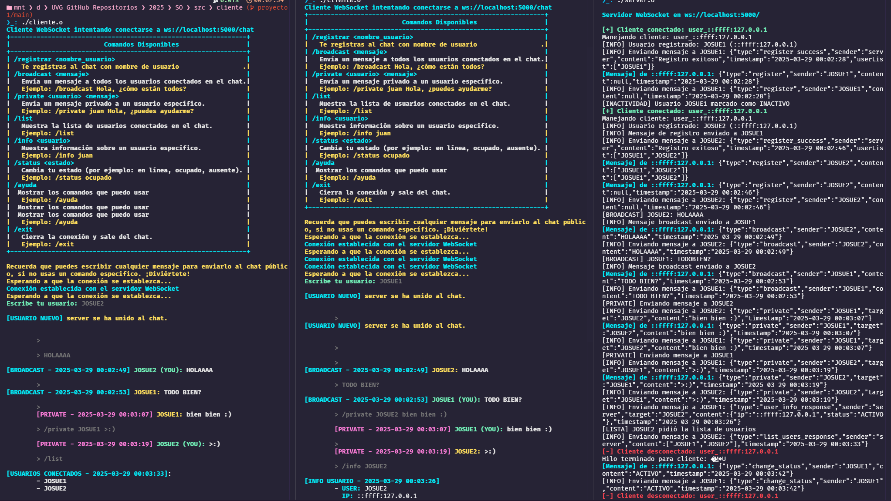
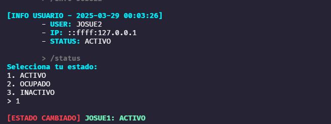

# Documentación del Cliente WebSocket en C para Chat

## Compilación y Ejecución

### Comando para compilar

```bash
gcc cliente.c parser.c ui.c -o cliente.o -lwebsockets -lpthread -lcjson
```

### Comando para ejecutar

```bash
./cliente.o
```

## Estructura General del Cliente

| Archivo         | Descripción                                                                 |
|----------------|------------------------------------------------------------------------------|
| `cliente.c`    | Lógica principal del cliente, lectura del usuario, conexión y manejo WebSocket |
| `parser.c`     | Creación y parseo de mensajes JSON                                            |
| `ui.c`         | Colores, menús, interfaz visual del cliente                                 |
| `getENV.c`     | Carga de variables del archivo `.env`                                        |
| `parser.h`     | Encabezado de funciones JSON y estructuras auxiliares                        |
| `ui.h`         | Encabezado para UI: colores y comandos                                        |

## Archivos Clave

### .env

Archivo de configuración con variables utilizadas por el cliente:

```env
SERVER=localhost
PUERTO=5000
```

- `SERVER`: Puede cambiarse a la IP o dominio del servidor WebSocket
- `PUERTO`: Puerto en el que escucha el servidor

## Librerías y Para Qué Se Usan

- `stdio.h`: Entrada/salida estándar (printf, scanf)
- `stdlib.h`: Memoria dinámica (malloc, free), conversiones (atoi)
- `string.h`: Manipulación de cadenas (strcpy, strcmp)
- `arpa/inet.h`, `netinet/in.h`, `netdb.h`: Direcciones IP (gethostbyname, inet_ntoa)
- `unistd.h`, `sys/socket.h`, `sys/types.h`: Operaciones POSIX (gethostname, usleep)
- `libwebsockets.h`: Librería principal para manejar conexiones WebSocket
- `pthread.h`: Hilos para concurrencia (pthread_create)
- `signal.h`: Manejo de interrupciones (SIGINT)
- `cjson/cJSON.h`: Para trabajar con objetos JSON en C

## Variables Globales Clave

```c
static int connection_open = 0;
static char nombre_usuario_global[50] = "";
static char status_global[50] = "ACTIVO";
```

- `connection_open`: Bandera para saber si la conexión WebSocket está activa
- `nombre_usuario_global`: Nombre del usuario actual
- `status_global`: Estado del usuario actual (ACTIVO/OCUPADO/INACTIVO)

## Hilos (Threads)

- `leer_mensajes`: Permite al usuario escribir mensajes sin bloquear la interfaz
- `escuchar_servidor`: Mantiene la conexión WebSocket y procesa eventos

Ambos hilos usan `pthread_create` para ejecutarse en paralelo.

## Conexión con el Servidor

```c
lws_context *context = lws_create_context(&info);
lws_client_connect_via_info(&ccinfo);
```

- El **contexto** (`lws_context`) es el entorno donde ocurren los eventos WebSocket
- `wsi` es el socket individual del cliente que representa la conexión WebSocket

## Comunicación Cliente-Servidor

### Cliente envía JSON

- `/broadcast <msg>`: mensaje para todos
- `/private <usuario> <msg>`: mensaje privado
- `/list`: lista de usuarios conectados
- `/info <usuario>`: info de un usuario
- `/status`: cambiar estado
- `/exit`: desconectarse

### Cliente recibe JSON

- `register_success`, `broadcast`, `private`, `list_users_response`, `user_info_response`, etc.
- Estos se manejan en la función `showFormattedMessage()`

## parser.c

Contiene funciones para:

- Crear JSON con `cJSON`: `crearJson_register`, `crearJson_private`, etc.
- Parsear JSON recibido: `parse_json`
- Eliminar espacios mal ubicados: `remove_spaces`
- Extraer subcadena JSON desde una entrada: `extract_json`

## ui.c

- Establece colores para consola con ANSI
- Muestra comandos con `mostrar_comandos()`
- Permite al usuario cambiar su estado con `seleccionar_estado()`

## Dependencias

- **libwebsockets**
- **pthread** (ya incluida en sistemas POSIX)
- **cJSON** (`sudo apt install libcjson-dev` en Ubuntu)

## Ejemplo de Uso

```bash
# .env
SERVER=localhost
PUERTO=5000

# Compilar
gcc cliente.c parser.c ui.c -o cliente.o -lwebsockets -lpthread -lcjson

# Ejecutar
./cliente.o
```




