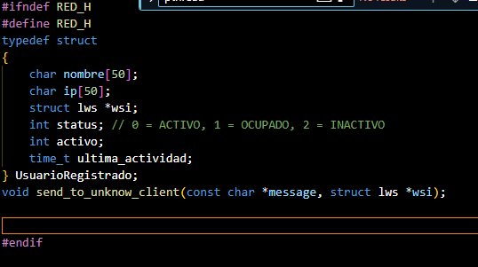

# Servidor

## Demostracion Funcinammiento

### Atención con multithreading

Se creo una estructura como esta un id, un ip, un hilo y una referencia al socket aqui

Luego se crea un hilo por cada cliente

Luego se destruye el hilo al salir de la sesion

Se usa mutex para reservar funciones y procesos

### Broadcasting y mensajes directos  

### Registro de usuarios

### Manejo de status

### Liberación de usuarios

### Respuesta a solicitudes de información de usuario(s) 

## Funciones y Estructuras

# Documentación del Código

## parser.h

Este archivo de encabezado (`parser.h`) define funciones para analizar y procesar datos en la aplicación.

### Funciones:

- **parse_message(const char *message)**  
  _Descripción:_ Procesa un mensaje recibido y lo interpreta según el protocolo definido en la aplicación.

- **get_command(const char *message)**  
  _Descripción:_ Extrae el comando principal de un mensaje.

- **get_parameters(const char *message, char *parameters)**  
  _Descripción:_ Obtiene los parámetros de un mensaje dado.

---

## red.h

Este archivo define la estructura de un usuario registrado y funciones relacionadas con la comunicación en red.

### Estructuras:

- **UsuarioRegistrado**  
  _Descripción:_ Representa un usuario en la red con la siguiente información:
  - `nombre`: Nombre del usuario.
  - `ip`: Dirección IP del usuario.
  - `wsi`: Puntero a la estructura de WebSockets.
  - `status`: Estado del usuario (0 = ACTIVO, 1 = OCUPADO, 2 = INACTIVO).
  - `activo`: Indica si el usuario está activo.
  - `ultima_actividad`: Almacena la última actividad registrada del usuario.

### Funciones:

- **send_to_unknow_client(const char *message, struct lws *wsi)**  
  _Descripción:_ Envía un mensaje a un cliente desconocido mediante WebSockets.

---

## red.c

Este archivo contiene la implementación de las funciones relacionadas con la comunicación en red.

### Funciones:

- **connect_client(const char *ip, const char *nombre)**  
  _Descripción:_ Establece conexión con un cliente en la red.

- **disconnect_client(UsuarioRegistrado *usuario)**  
  _Descripción:_ Desconecta a un usuario registrado en la red.

- **send_message(const char *message, UsuarioRegistrado *usuario)**  
  _Descripción:_ Envía un mensaje a un usuario específico.

- **broadcast_message(const char *message)**  
  _Descripción:_ Envía un mensaje a todos los usuarios activos en la red.

- **update_user_status(UsuarioRegistrado *usuario, int status)**  
  _Descripción:_ Actualiza el estado de un usuario en la red.

---

